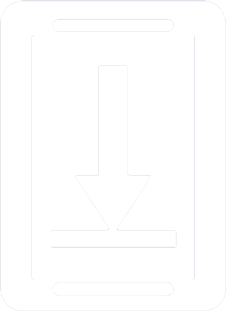

# &nbsp;&nbsp;Save On Device

An Android app that allows you to save files on your device from other apps using the Share or View functionality.

  

## Features
- Save files and shared text from other apps to local storage through the share sheet
- Fully rewritten with modern Kotlin (Jetpack Compose, Coroutines, type-safe Contracts) replacing deprecated methods
- Material You design language and color support
- Supports Android 5.0 and newer, all the way up to Android 16

This is a fork of [Save on device](https://github.com/AbdurazaaqMohammed/save-on-device) by AbdurazaaqMohammed which is a fork of the [original](https://github.com/lmj0011/save-on-device) by lmj0011.

## License

    Copyright 2023 Landan Jackson

    Licensed under the Apache License, Version 2.0 (the "License");
    you may not use this file except in compliance with the License.
    You may obtain a copy of the License at

    http://www.apache.org/licenses/LICENSE-2.0

    Unless required by applicable law or agreed to in writing, software
    distributed under the License is distributed on an "AS IS" BASIS,
    WITHOUT WARRANTIES OR CONDITIONS OF ANY KIND, either express or implied.
    See the License for the specific language governing permissions and
    limitations under the License.
